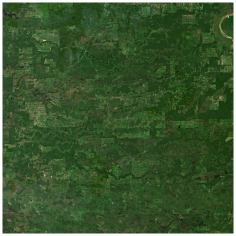
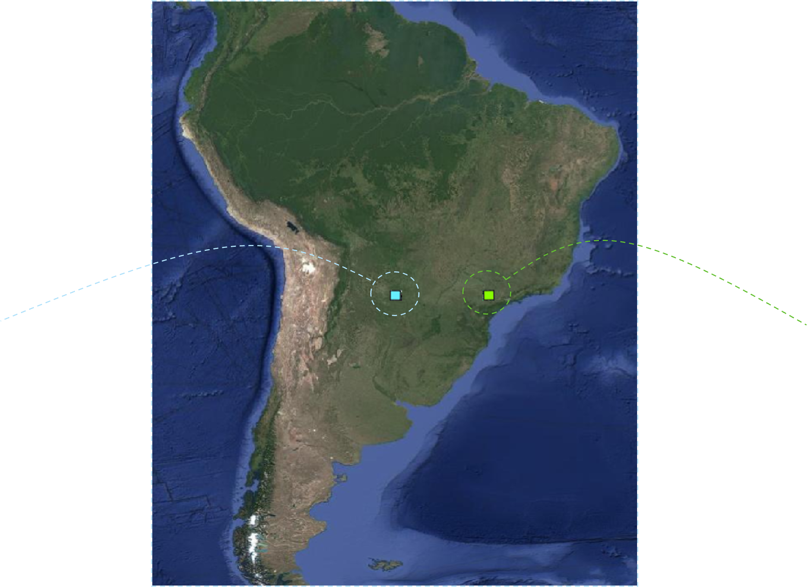
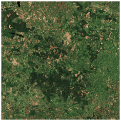

# 🗺️ High Resolution Land Cover Mapping

> 🏫 University of Trento | 🛰️ Remote Sensing Lab | 📅 A.Y. 2024/2025 | 🎓 Master Thesis

  <video src="https://github.com/user-attachments/assets/4dbe472a-9cca-4cff-8756-371fbb9e9bbc" controls width="720">
  </video>

## Abstract

...testo dell'abstract...

## Study Area

  
  
  

<i>Clicca su una tile per aprire la visualizzazione interattiva →</i>

