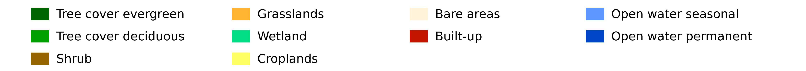
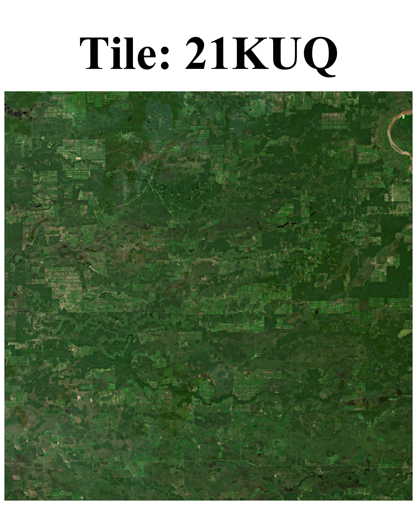
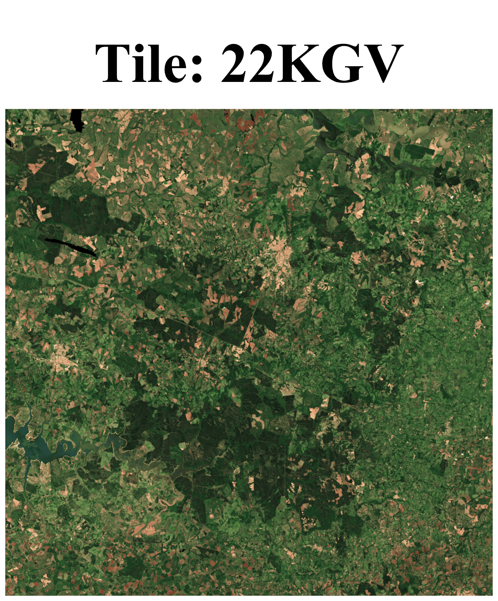

# 🗺️ Weakly Supervised Land Cover Mapping 

> 🏫 University of Trento | 🛰️ Remote Sensing Lab | 📅 A.Y. 2024/2025 | 🎓 Master Thesis

> 🚦Codice sorgente disponibile su richiesta.

<p align="center">
  <video src="https://github.com/user-attachments/assets/4dbe472a-9cca-4cff-8756-371fbb9e9bbc" controls width="720">
  </video>
</p>

<p align="center">
  
</p>

Land cover (LC) mapping provides structured information essential to inform public and private decisions. As the demand for reliable, high-resolution LC products continues to grow, so does the need to overcome the primary bottleneck that currently limits their accuracy: the scarcity of high-quality training labels. An interesting research direction is to exploit LC products already available as weak label sources to train new models. Although they present several misclassifications, such as artifacts and temporal inconsistencies, they represent a large source of readily available information at little to no cost. In this thesis we addressed the problem of how to extract valuable information from a pool of heterogeneous LC products. We proposed a multi-task framework where a set of LC products is used as independent tasks to train our model. The complementary supervision signals provided by the different sources allow the shared backbone to learn a rich data representation encoding relevant information for all tasks. This embedding vector is then mapped to final predictions by the respective classification heads. The hard parameter sharing paradigm already encourages the model to integrate information from the various tasks. However, to ensure further consistency among the final outputs, we introduced a consensus mechanism inspired by Weikmann et al. [[1]](#ref1).

<p align="center"><b>CLICK on a tile to visualize the results</b></p>

<p align="center">
  <a href="http://3.120.171.141/21kuq/">
    
  </a>
  
  <a href="http://3.120.171.141/22kgv/">
    
  </a>
</p>

## Motivation

To understand the reason of this work, try to answer this apparently simple question: *How big is the Amazon rainforest?*

Providing a reasonable estimate has been a challenging task for decades. Early attempts relied on ground campaigns, which were demanding and of limited accuracy. It was only with the advent of satellites that the margin of error reduced drastically. Given a satellite acquisition of the Amazon basin, one simply needs to count all pixels associated with the rainforest. Multiplying the number of pixels by their spatial resolution we get our estimate: around 6 million square kilometers.

This simple example gives a first hint of the potential of land cover mapping,  which consists of segmenting an image of an area by assigning each pixel to a class according to its biophysical surface type. However, the power of this approach extends far beyond area estimation. With satellite archives now spanning over thirty years, we can analyze ecosystem evolution over time and detect changes. For instance, we can identify which areas have been deforested and estimate when that happened, monitor urban sprawl, track wetland loss, observe the expansion of agricultural fields and plantations, assess the impact of mining activities and study water body dynamics. These data represent an invaluable source of information to keep track of land cover changes. However, how to extract this information is still an active research area.

In the last decade, significant progress in the field has been achieved thanks to three converging factors: the development of new models able to effectively capture spatial and temporal dependencies in satellite data; the scale of computational capabilities that enabled processing of petabytes of imagery; and the availability of open satellite data granted by new policies adopted by NASA and ESA. The primary bottleneck in the development of reliable systems is now represented by the scarcity of highly accurate training data, whose generation is expensive and resource-intensive due to several inherent challenges.
First, the spatial extent of target regions makes it infeasible to manually label entire areas or even substantial portions. A second reason is the variability of class features within the region of interest, requiring a proper sampling of the training datasets. Moreover, properly labeling the data requires domain expertise. While crowdsourcing could be suitable for very high resolution classification tasks, more skills are necessary to interpret multispectral or hyperspectral imagery, which is generally characterized by lower spatial resolution but richer spectral information. Finally, determining which samples should be prioritized is complex: points that are easy to classify may be less informative compared to boundary pixels or those pixels containing class mixtures. All these factors make the production of representative training datasets challenging, labor-intensive and costly.

Many approaches have been explored to deal with this constraint. One of the most promising is weak supervision, which consists of leveraging less reliable labels from multiple heterogeneous sources to create the large-scale datasets required for training deep learning models. By integrating information from diverse sources, this approach can potentially yield more robust systems capable of identifying features and patterns more effectively. Many specific aspects need to be considered while developing weak supervision strategies. Data from different sources must first be harmonized to a common spatial reference system and resolution. Geolocation errors, projection distortions and resampling artifacts can cause spatial misalignments, leading to systematic misclassifications. Moreover, labels assigned to the same pixel may be in conflict across various sources due to differences in classification schemes or labeling errors. Temporal mismatches add further complexity: maps are often produced at different times, so discrepancies may reflect real land-cover changes rather than classification errors. Finally, label uncertainty can be due to specific samples, to their classes or to model biases caused by a domain shift with respect to the training region.

## Proposed Approach

In this work, we propose a multi-task weakly supervised framework for land cover mapping that exploits a set of heterogeneous digital products as independent tasks. The architecture consists of a shared backbone and multiple classification heads, each yielding predictions over a distinct task. We adapt the consensus mechanism proposed in [[1]](#ref1), originally developed to learn the hierarchical structure inherent in land cover classes, and show that the same principle can be applied to learn cross-task correlations between classes across different classification tasks. Building on this, we develop an integrated framework that simultaneously enforces hierarchical and cross-task consistency.
The combination of hard parameter sharing with the proposed consensus mechanism allows the model to learn a robust data representation, mitigating the adverse effects of label noise present in the weak sources. A key strength of the approach is that semantic consistency is enforced in a fully self-supervised manner, and the learned relationships are encoded in interpretable matrices. To validate the method, we consider four freely available digital products as independent tasks within two large areas in Amazonia: three land cover maps and a canopy height map. Despite their differing resolutions, classification schemes and temporal inconsistencies, the framework successfully integrates the complementary supervision signals provided by each source, yielding more robust data representations. Finally, we investigate the use of learned cross-task relationships for domain adaptation, showing that when inter-task correlations are sufficiently stable across regions, they can be leveraged to recover supervision for a missing label source in the target area.

Our main contributions can be summarized as follows:
1. We demonstrate that more accurate land cover maps can be derived by integrating multiple outdated digital products.
2. We propose a multi-task weak supervision framework that exploits class relationships across different label sources through a consensus mechanism.
3. We introduce a loss function that aligns classification and regression tasks, with learned weights that reflect physically meaningful inter-class relationships.
4. We show that learned relationships can be exploited for domain adaptation.

## Multi Level Semantic Consensus

In the original paper, the mechanism had been developed to exploit the hierarchical structure inherent to land cover classes. Specifically, a set of hierarchical levels is introduced with a corresponding set of classes. However, the relationships between coarser and finer classes are not hard-coded but are instead learned at training time. In particular, the hierarchical dependencies are encoded into matrices representing the joint probability of observing one class at a certain granularity level while a second class is present at another level. We observed that the proposed mechanism can be generalised beyond the hierarchical framework by interpreting the learned relationships as correlations between independent predictions. In this way, hierarchical levels can be replaced by heterogeneous tasks while the learnable matrices continue to align predictions between different classification heads.

The learned cross-task matrices encode the joint probability of co-occurrence of two classes across two different tasks and can be used to project predictions from one task onto another. To learn these matrices, an additional penalty term is introduced that penalises disagreement between predictions at different levels. For each classification task, a consensus is first reached among the projected predictions from all other tasks. Then, we penalize the discrepancy of each projection from the obtained consensus.
The hierarchical structure and cross-task correlations represent valuable supervision signals to mitigate the noise present in the weak labels. Therefore, we integrated both constraints, proposing a multi-level multi-task consensus framework. We consider a set of independent classification tasks and a common hierarchical structure containing all desired granularity levels. For each task and each hierarchical level, there is a classification head together with a set of hierarchical and cross-task matrices. Hierarchical matrices learn the relationships between classes at different granularity levels within the same task, while cross-task matrices encode correlations between classes across tasks at the same hierarchical level. This multi-level multi-task framework injects information coming from different sources at the appropriate granularity level, favouring its smooth propagation. Moreover, the resulting consensus network provides robust data-driven supervision signals that reconcile errors and differences in classification schemes present in the weak sources.

We further investigated the case where regression tasks are available. The consensus mechanism discussed so far cannot be applied directly to this scenario. Therefore, we introduced a simple loss to align predictions on the regression and classification tasks. The underlying idea is to learn for each class, an estimated value for the regression task, and then to increase the confidence in classes whose estimated value aligns with the regression prediction while lowering those where a large mismatch is observed. In the ideal case, the learned parameters converge to the per-class mean value over the regression task, providing a physically interpretable quantity.

<!--


## Model


-->

## Datasets
  
**Satellite imagery**:
  - *Time Series*: 12 monthly pre-processed composites derived from Sentinel-2 multispectral acquisitions within a two-month window.
  - *Channels*: 12 stacked bands involving 10 higher resolution Sentinel 2 channels, NDVI, NDWI
  - *Study Areas*: tile 21KUQ, tile 22KGV [Military Grid Reference System], each spanning 100km x 100km
  - *Resolution*: 10m per pixel 

**Weak Labels**:
  - [*HRLC*](https://climate.esa.int/en/projects/high-resolution-land-cover/) Phase 1 map, a land cover map at 10mpx resolution for 2019
  - [*WorldCover*](https://esa-worldcover.org/en), a land cover map at 10mpx resolution for 2020
  - [*MapBiomas*](https://mapbiomas.org/), a land cover map at 10mpx resolution for 2019
  - [*Global Forest Canopy Height*](https://glad.umd.edu/dataset/gedi), a forestry canopy height map at 30mpx resolution for 2019
  - [*OpenStreetMap*](https://www.openstreetmap.org), a vector map of streets for 2019

## Results

<p align="center">
  <a href="http://3.120.171.141/21kuq/">
    
  </a>
  
  <a href="http://3.120.171.141/22kgv/">
    
  </a>
</p>
<p align="center"><b>CLICK on a tile to visualize the results</b></p>

The new land cover maps obtained for tile 21KUQ and tile 22KGV can be visualized by clicking on the respective image in the picture above. In particular, each web page provides the rgb image derived from the December composite, the HRLC-Phase 1 map and the map provided by the new model.

<!--
learnt relationship and some tables
-->

## Struttura Progetto

> 🚦Codice sorgente disponibile su richiesta.

```
├── scripts/                        # Folder containing experiment setups
│   └── exp_<id>/                   # Each experiment folder (e.g., exp_0, exp_1, ...)
│       ├── config_files/           # Config files for the experiment
│       │   └── exp_<id>.yaml
│       └── exp_<id>.py             # Main script for the experiment
│
├── src/                            # Source code modules
│   ├── datasets/                   # Data loading and preprocessing
│   ├── models/                     # Model architectures
│   ├── losses/                     # Custom loss functions
│   └── utils/                      # Utility functions
│
├── .gitignore
├── Dockerfile
├── entrypoint.sh
├── launch_docker.sh
├── launch_queue.sh
├── LICENSE
├── pyproject.toml
└── README.md

```

## Main Reference Papers
<a id="ref1"></a>
[1] G. Weikmann, G. Perantoni, and L. Bruzzone, "A Semantics-Aware Hierarchical Self-Supervised Approach to Classification of Remote Sensing Images." [[arXiv]](https://arxiv.org/abs/2510.04916)
